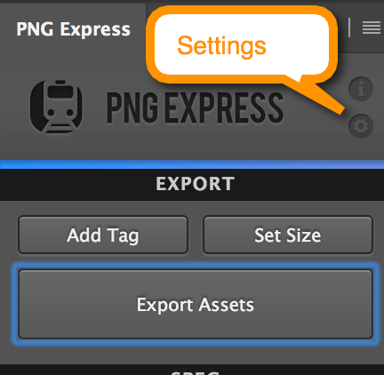
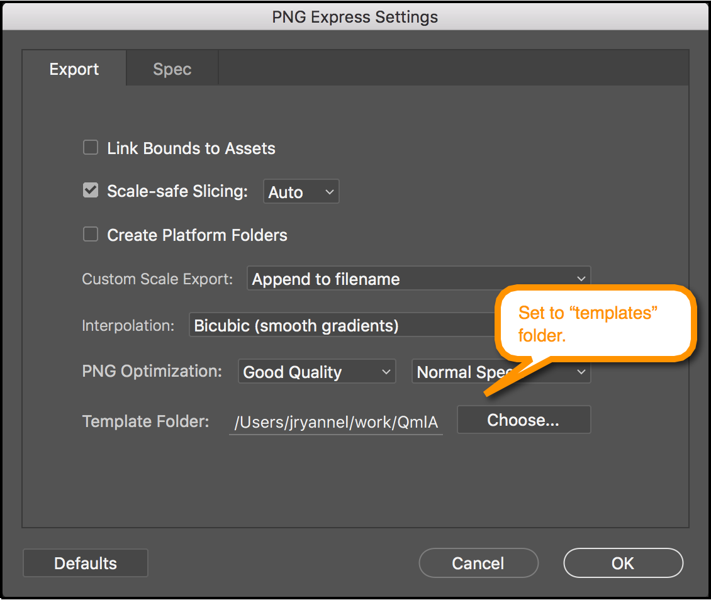
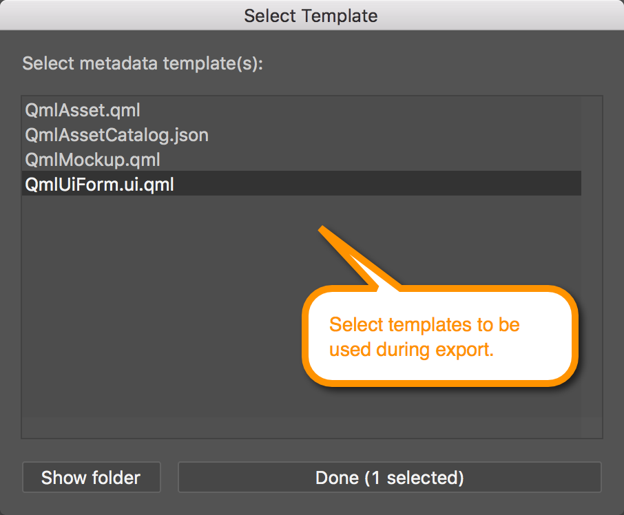

# Installing

PNGExpress allows you to set a template folder in the settings panel of PNGExpress. You need to set the used template folder to the `templates` folder of this repository.

In the Export Assets dialog the you need to click on "Select templates..." to select the templates you want to use during export.

In the export folder the templates will generate one or more extra files based on the choosen templates.
