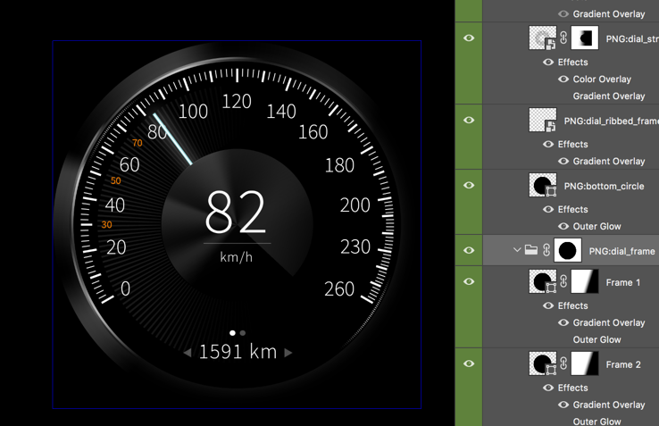
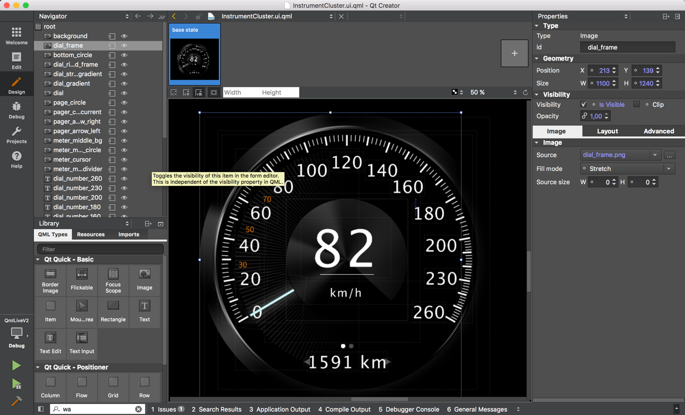

# QML Asset Exporter from Photoshop

The templates used here are based on PNGExpress (http://www.pngexpress.com)
for PhotoShop. PNGExpress allows a designer to slice and export PSD documents
to individual PNG, JPG and SVG assets. On top of this it allows also to export
meta information from the PSD document and the exported information can be
formatted using a template language. For more information on the individual
features and the template syntax, please read the PNGExporess excellent user
guide (http://www.pngexpress.com/support.html).

## Templates

The templates presented allows the user to export information from the
document as an individual UI QML form per document for to export per asset a
QML document.

## QML UI Forms Document Template

This template generates a QtQuick UI Form (`.ui.qml`) document from the PSD document. The generated document
file name is based on the PSD document name. Graphics as also
Text objects are exported with absolute positioning. Text object are
exported with font and alignment information.



The resulting document can be used with the QtQuick Designer to further adjust
the different user interface objects. This is a great tool for fast prototyping
and bringing a static PSD document to live.



```js

import QtQuick 2.4

FocusScope {
    id: root
    width: 1691
    height: 1440

    property alias background : background
    property alias dial_frame : dial_frame
    ...

    property alias dial_number_0: dial_number_0
    ...
    property alias kmh: kmh


    Image {
        id: background
        x: 0
        y: 0
        width: 1691
        height: 1440
        source: "background.png"
        z: 0
        visible: true
        opacity: 100/100
    }

    Image {
        id: dial_frame
        ...
    }

    Text {
        id: dial_number_0
        text: "0"
        x: 387
        y: 943
        width: 141
        height: 69
        font.family: "Source Sans Pro Light"
        font.pixelSize: 72
        color: "#FFFFFF"
        z: 22
        horizontalAlignment: Text.AlignHCenter
        verticalAlignment: Text.AlignVCenter
        visible: true
        opacity: 100/100
        font.letterSpacing: +3.6

    }

    Text {
        id: kmh
        text: "km/h"
        ...
    }
}
```


You can use now the UI Form inside your own QtQuick document and modify individual properties.

```js
import QtQuick 2.4

import "assets"

InstrumentCluster {
    dial_frame.opacity: 0.5
    kmh.text = "miles"
}
```

The next time the designer adjust the geometry of the scene, as a develop you mainly have to re-export the assets.


## QML Asset Template

Each tagged graphics or text asset will be exported as own QML document to be
usable inside your project.

The asset document contains the PSD layer plus the variants and states as defined by PNGExpress.

```js
import QtQuick 2.4

Image {
    id: root
    source: meter_middle_bg
    property string meter_middle_bg: "meter_middle_bg.png"
}
```

* TODO: Fix the naming of QML Files to be more better readable
* TODO: Support visual content adjustment
* TODO: Support BorderImage support

## QML Asset Catalog Template

A document will be generated to be brows able by the developer to inform
them self on individual assets names and dimension.

* TODO: Write the export template
* TODO: Write AssetCatalog tool to load the asset catalog.


